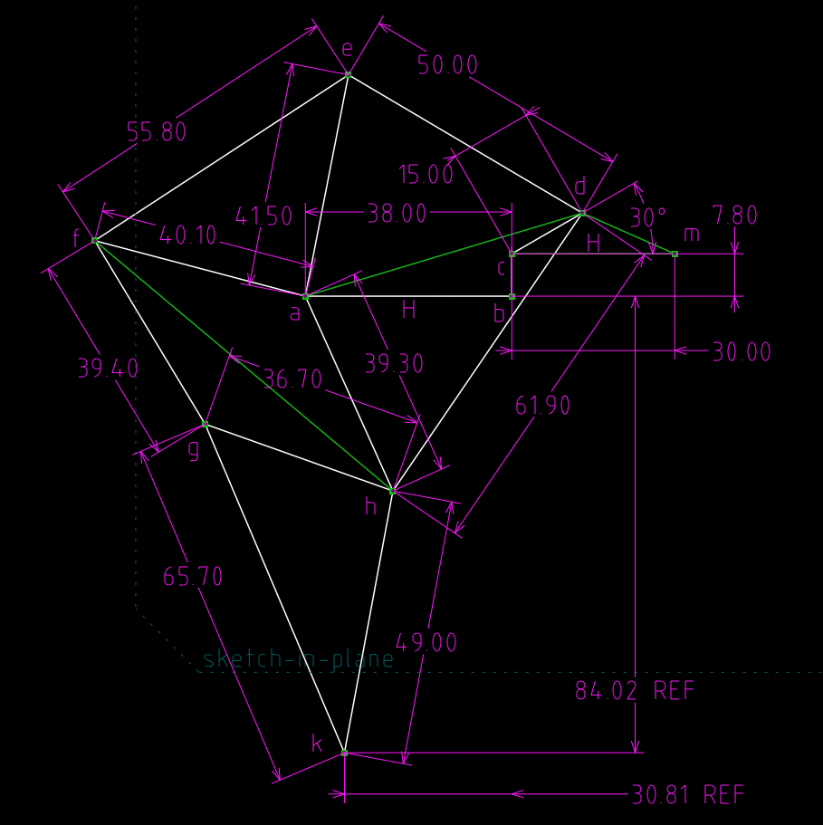

Title: 網際 Brython 3.3.1 程式執行環境 
Date: 2017-03-14 11:00
Category: Course
Tags: brython, w1
Slug: kmol-brython-editor-331
Author: yen

Brython 程式環境可以用來練習許多 Python3 的簡單語法, 也可以納入 Javascript 程式庫, 利用 Ajax 模式結合網際瀏覽器與伺服器上的資源解決協同產品設計流程上的問題.

<!-- PELICAN_END_SUMMARY -->

<!-- 導入 FileSaver 與 filereader -->

<!-- 導入最新版的 Brython 標準程式庫 3.3.1 -->

<!-- 啟動 Brython 時, 設定 pythonpath 為 data/py, 並將 script1.py 放入, 以便取代 3.2.9 之前版本的 script id 導入 -->

<!-- 以下執行 Brython 程式 -->

列出 2017 Spring 協同產品設計實習課程日期之 Python 程式碼如下:

<pre class="brush: python">

</pre>

### 利用伺服器執行 Python3 程式

Jupyterhub: <a href="https://8888.kmol.info:9443">https://8888.kmol.info:9443</a>

### 利用以下的編輯器執行 Python3 程式

在 Firefox 中, 以 Preferences - General - Downloads 選擇"Always ask me where to save files"

在 Chrome 中, 以 Settings - Advanced - Downloads 選擇 Ask where to save each file before downloading

<!-- 請注意, 這裡使用 Javascript 將 localStorage["py_src"] 中存在近端瀏覽器的程式碼, 由使用者決定存檔名稱-->

<!-- 請注意 Brython 3.3.0 之後的版本, 已經不能使用 script id 模式導入, 改用 pythonpath 中的 script1.py 供後續導入 -->

<!-- 以下的表單與按鈕與前面的 Javascript doSave 函式以及 FileSaver.min.js 互相配合 -->

<form>
    <label>Filename: <input type="text" id="filename" placeholder="input file name"/>.py</label>
    <input type="submit" value="Save" onclick="doSave();"/>
</form>
<button id="run">Run</button>
<button id="show_console">Output</button>
<button id="clear_console">清除</button>

<textarea id="console" autocomplete="off"></textarea>

<a id="ex1">ex1</a>-for 迴圈

<a id="ex2">ex2</a>-溫度換算

<a id="ex3">ex3</a>-多連桿機構

<button id="get">for1.py</button><button id="get_temp1">temp1.py</button><button id="get_ver_and_kw">ver_and_kw.py</button><button id="jansen">jansen.py</button>

Jansen 多連桿機構尺寸圖:

