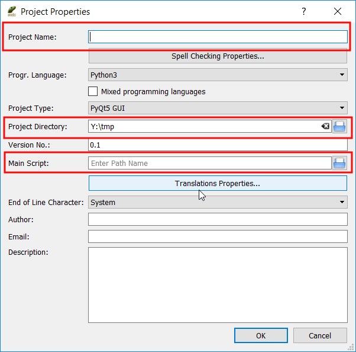
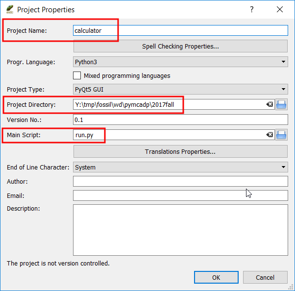
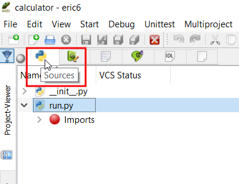
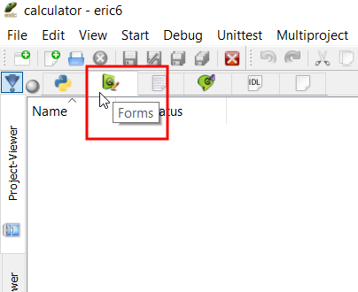
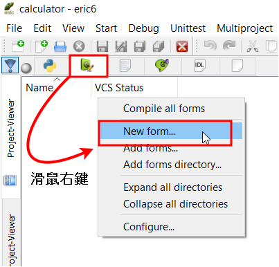
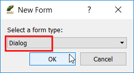
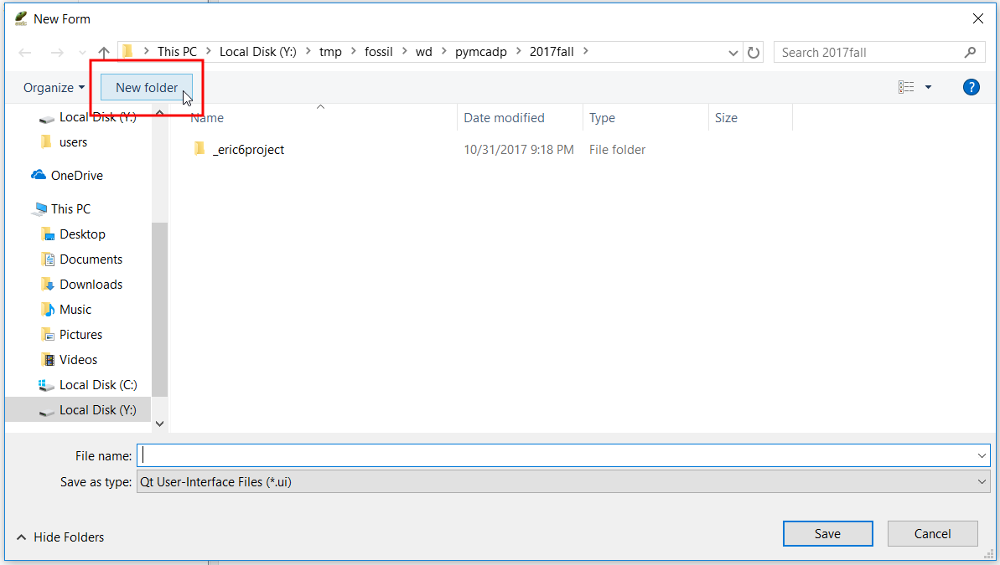
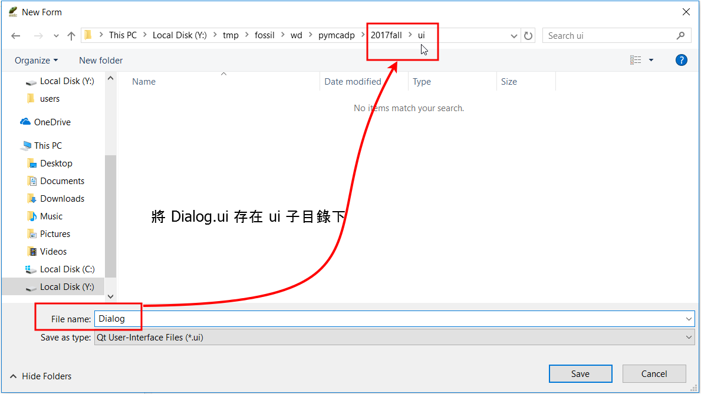
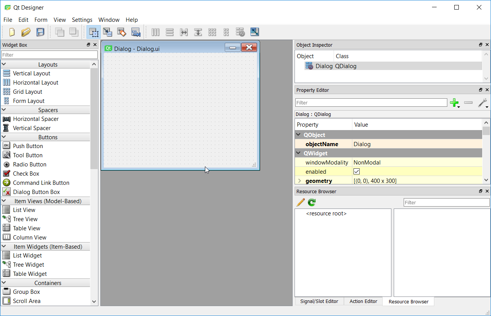

Title: CP PyQt5 視窗程式 (一)
Date: 2017-10-31 13:00
Category: Course
Tags: 2017fall, PyQt5
Slug: kmol-2017-fall-pyqt5-1
Author: yen

2017 年 Fall 的計算機程式課程開始導入 <a href="http://pyqt.sourceforge.net/Docs/PyQt5/modules.html">PyQt5</a> 視窗程式教學, 其中使用 <a href="https://eric-ide.python-projects.org">Eric6</a> 整合開發環境簡化初學者建立視窗表單.

<!-- PELICAN_END_SUMMARY -->

<iframe src="https://player.vimeo.com/video/242527163" width="640" height="512" frameborder="0" webkitallowfullscreen mozallowfullscreen allowfullscreen></iframe>

<a href="https://vimeo.com/242527163">國立虎尾科技大學機械設計工程系計算機程式 - 一乙第十週第一部分, 說明如何客製化可攜程式系統, 直接以 start.bat 開啟 Leo Editor, 並開啟內定的專案檔</a> from <a href="https://vimeo.com/user24079973">國立虎尾科技大學機械設計工程系</a> on <a href="https://vimeo.com">Vimeo</a>.

<iframe src="https://player.vimeo.com/video/243035518" width="640" height="491" frameborder="0" webkitallowfullscreen mozallowfullscreen allowfullscreen></iframe>

<a href="https://vimeo.com/243035518">國立虎尾科技大學機械設計工程系計算機程式 - 一甲第十週第一部分, 說明如何客製化可攜程式系統, 直接以 start.bat 開啟 Leo Editor, 下載 Dia 與 Gimp 可攜程式, 用來編輯 2D 表達用的圖檔.</a> from <a href="https://vimeo.com/user24079973">國立虎尾科技大學機械設計工程系</a> on <a href="https://vimeo.com">Vimeo</a>.

<iframe src="https://player.vimeo.com/video/243037384" width="640" height="491" frameborder="0" webkitallowfullscreen mozallowfullscreen allowfullscreen></iframe>

<a href="https://vimeo.com/243037384">國立虎尾科技大學機械設計工程系計算機程式 - 一甲第十週第二部分, 說明如何利用 ShareX, Gimp 與 Dia 處理 2D 圖檔的內容標示.</a> from <a href="https://vimeo.com/user24079973">國立虎尾科技大學機械設計工程系</a> on <a href="https://vimeo.com">Vimeo</a>.

###手動建立 PyQt5 視窗介面

最簡單的 <a href="http://pyqt.sourceforge.net/Docs/PyQt5/modules.html">PyQt5</a> 程式直接利用 <a href="http://doc.qt.io/qt-5/qtwidgets-module.html">QtWidgets</a> 中的 <a href="http://doc.qt.io/qt-5/qwidget.html">QWidget</a> 呈現簡單的視窗, 然後利用 <a href="http://doc.qt.io/qt-5/qapplication.html">QApplication</a> 建立應用程式後, 以應用程式的 <a href="http://doc.qt.io/qt-5/qapplication.html#exec">exec()</a> 方法進入事件迴圈.

<pre class="brush: python">
# 導入 sys 模組
import sys
# 從 PyQt5 模組中導入 QtWidgets
from PyQt5 import QtWidgets

# 利用 QtWidgets.QApplication 類別建立應用程式案例物件, 名稱設為 app
app = QtWidgets.QApplication(sys.argv)
# 利用 QtWidgets.QWidget 類別建立視窗案例物件, 名稱設為 win
win = QtWidgets.QWidget()
# 利用視窗案例物件中的 show() 方法顯示 win 物件
win.show()
# 執行 app 物件中的 exec() 方法, 以進入事件迴圈, 同時允許使用者透過視窗右上方的 x 按鈕, 關閉視窗.
app.exit(app.exec())
</pre>

特別注意 <a href="http://pyqt.sourceforge.net/Docs/PyQt5/modules.html">PyQt5</a> 模組中的 P 與 Q 為大寫, 而 <a href="http://doc.qt.io/qt-5/qtwidgets-module.html">QtWidgets</a> 中的 Q 與 W 為大寫, <a href="http://doc.qt.io/qt-5/qapplication.html">QApplication</a> 中的 Q 與 A 為大寫, 而 <a href="http://doc.qt.io/qt-5/qwidget.html">QWidget</a> 中的 Q 與 W 為大寫.

另外, 利用 <a href="http://doc.qt.io/qt-5/qwidget.html#show">show()</a> 方法將視窗元件顯示後, 其下的程式流程仍可繼續執行, 而對話框中所使用的 <a href="http://doc.qt.io/qt-5/qapplication.html#exec">exec()</a> 方法將會一直到使用者關閉對話框後, 才會將程式的控制權交回.

<a href="http://doc.qt.io/qt-5/qtwidgets-module.html">QtWidgets</a> 模組提供一組使用者介面元件 (User Interface elements), 用來建立傳統視窗桌面樣式的使用者操作介面.

事件導向的 <a href="http://pyqt.sourceforge.net/Docs/PyQt5/modules.html">PyQt5</a> 程式基本控制流程為:

    建立 QApplication 應用程式物件
    建立視窗元件
    顯示視窗元件
    進入應用程式執行迴圈
    等待使用者所觸發的事件

###以 Eric6 建立 PyQt5 視窗介面

首先使用者必須利用可攜程式環境中的 fossil.exe 2.3 版 fossil clone https://mde1a1.kmol.info/pymcadp 倉儲, 操作指令為:

    選定要 clone 倉儲存檔的目錄, 一般建議為 y:\tmp\fossil 目錄
    更換目錄到倉儲存檔的目錄後, 執行 fossil clone https://mde1a1.kmol.info/pymcadp pymcadp.fossil
    將 pymcadp.fossil 開啟在其目錄下的 wd\pymcadp 目錄
    更換目錄到 wd\pymcadp 後, 執行 fossil open ./../../pymcadp.fossil

將遠端的 pymcadp 倉儲 clone 至近端後, 解開其最新版內容後, 接著就要配合 2017 Fall 的 CP 課程, 在倉儲中的 2017fall 目錄, 存放本學期隨後與課程配合的 Eric6 專案及程式碼, 各學員則配合參考 pymcadp 中的設計與配置, 在自己的倉儲中建立對應的目錄與專案內容.

####啟動 Eric6 IDE

在隨身碟中啟動 Eric6 只要點按 start.bat 後, 在命令列中執行 eric6 即可帶出整合開發環境.

之後, 從下拉式功能表中的 Project, 以 New 建立新專案, 使用者必須設定 Project Properties 畫面如下:

</img>

(以上 2D 圖像表達, 採用 <a href="https://getsharex.com/">ShareX</a> 擷取視窗區域存成圖檔後, 以 <a href="https://www.gimp.org/">GIMP</a> 編輯, 利用 Rectangle Select Tool 選定要以紅線標示的三個區域後, 再透過 <a href="https://www.gimp.org/">GIMP</a> 的 Edit-Stroke Selection 功能, 選擇標示框線的顏色、大小與樣式)

填入 2017 Fall CP 課程相關 Eric6 程式專案後,  Project Properties 視窗畫面如下:

</img>

亦即專案名稱設為 calculator, 專案目錄選擇位於 Y:\tmp\fossil\pymcadp\2017fall, 且 Main Script 設為 run.py

在 Eric6 的 Project-Viewer 視窗中, 前兩個頁面為原始碼頁與表單頁, 原始碼頁畫面如下:

</img>

表單頁面如下:

</img>

選擇表單頁面後, 以滑鼠右鍵新增表單:

</img>  (圖檔以 <a href="https://getsharex.com/">ShareX</a> 取 screenshot 後, 以 <a href="https://www.gimp.org/">Gimp</a> 加入紅色框線後, 以 <a href="https://sourceforge.net/projects/dia-installer/">Dia</a> 加入指向曲線與標註文字)

計算機使用的表單為 Dialog:

</img>

將表單相關檔案存入新增的目錄中:

</img>

</img>

新增表單設定完成後, Eric6 自動開啟 Qt Design 畫面:

</img>

<a href="http://doc.qt.io/qt-5/qabstractbutton.html">QAbstractButton Class</a>

<a href="http://doc.qt.io/qt-5/qlineedit.html">QLineEdit Class</a> (<a href="http://pyqt.sourceforge.net/Docs/PyQt4/qlineedit.html">PyQt4 的 QLineEdit 說明</a>)

<a href="http://doc.qt.io/qt-5/layout.html">Layout Management</a>

<a href="http://pyqt.sourceforge.net/Docs/PyQt5/class_reference.html">PyQt5 Class reference</a>

