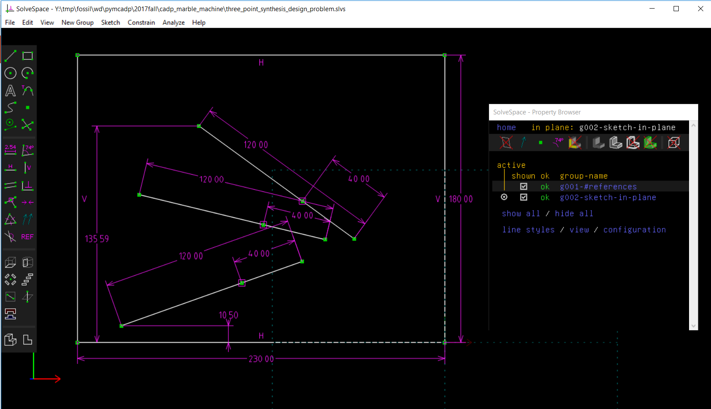
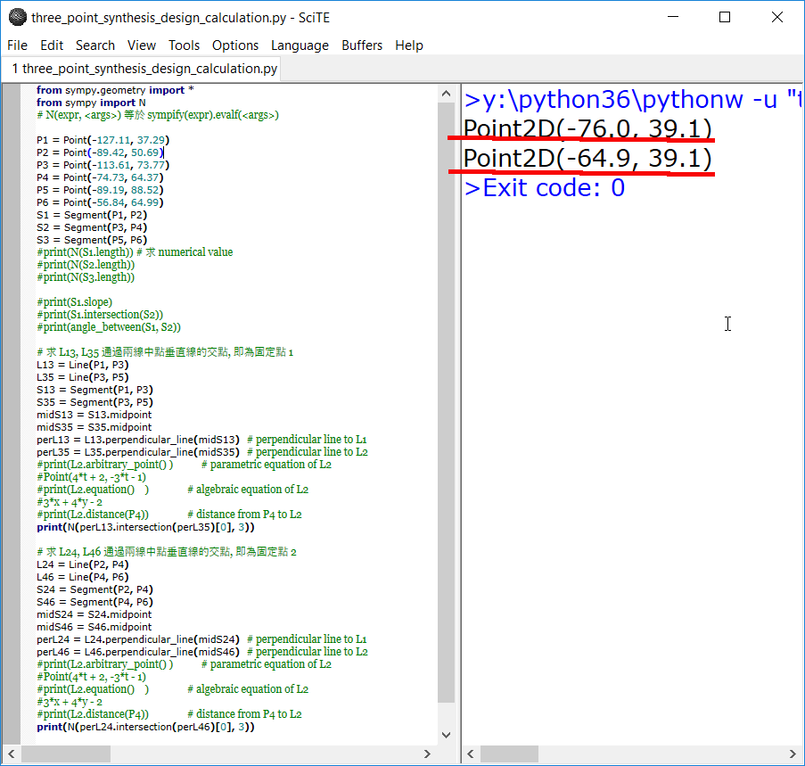
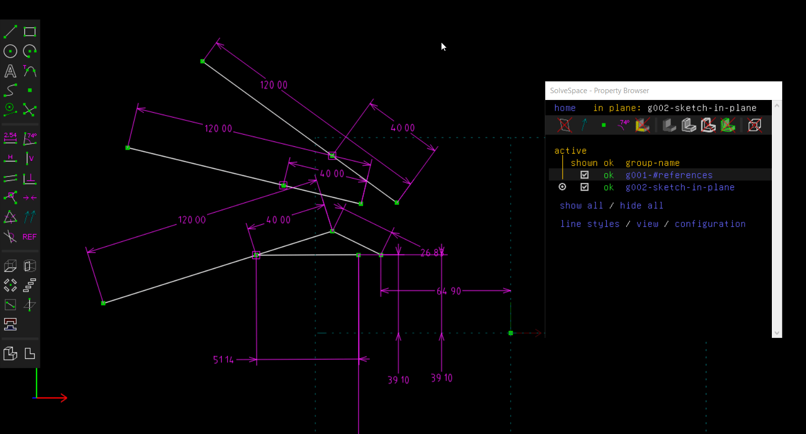
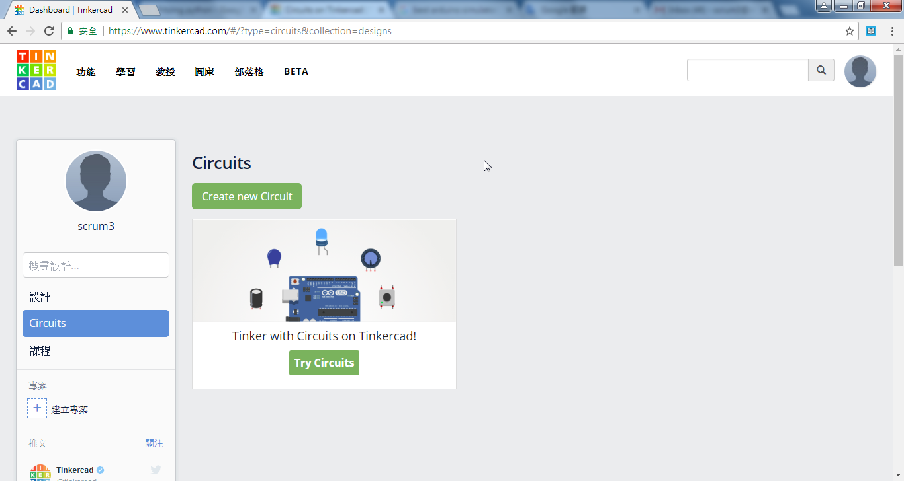
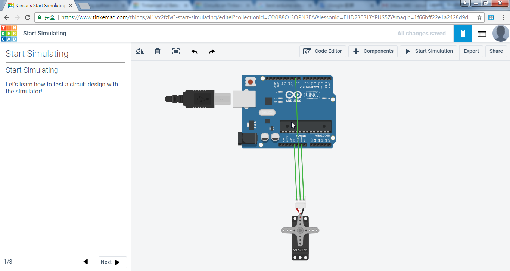

Title: CADP 鋼球運動系統電腦輔助設計
Date: 2017-11-14 11:00
Category: Course
Tags: 2017fall, cadp, fourbar, synthesis
Slug: kmol-2017-fall-cadp-fourbar-three-position-synthesis
Author: yen

2017 Fall CADP 課程的機電資整合實習題目為: 可重複循環運作的鋼球運動系統, 其中包括機械領域的: 機構運球系統與模組化軌道設計, 電子領域的: Arduino 伺服馬達控制設計, 以及資訊領域的: [PyQt5] 監控程式系統設計等三個部分.

<!-- PELICAN_END_SUMMARY -->

<iframe src="https://player.vimeo.com/video/243063216" width="640" height="491" frameborder="0" webkitallowfullscreen mozallowfullscreen allowfullscreen></iframe>

<a href="https://vimeo.com/243063216">國立虎尾科技大學機械設計工程系電腦輔助設計實習 - 二甲第十週第一部分, 說明何謂電腦輔助設計? 以及如何進行機電資實習專案.</a> from <a href="https://vimeo.com/user24079973">國立虎尾科技大學機械設計工程系</a> on <a href="https://vimeo.com">Vimeo</a>.

<iframe src="https://player.vimeo.com/video/243070610" width="640" height="491" frameborder="0" webkitallowfullscreen mozallowfullscreen allowfullscreen></iframe>

<a href="https://vimeo.com/243070610">國立虎尾科技大學機械設計工程系電腦輔助設計實習 - 二甲第十週第二部分, 說明如何利用 AutoDesk TinkerCAD 中的 Circuits 模擬 Arduino 伺服馬達控制.</a> from <a href="https://vimeo.com/user24079973">國立虎尾科技大學機械設計工程系</a> on <a href="https://vimeo.com">Vimeo</a>.

<iframe src="https://player.vimeo.com/video/243073950" width="640" height="513" frameborder="0" webkitallowfullscreen mozallowfullscreen allowfullscreen></iframe>

<a href="https://vimeo.com/243073950">國立虎尾科技大學機械設計工程系電腦輔助設計實習 - 二甲第十週第三部分, 從 TinkerCAD 中下載 Marble Machine 軌道範例, 轉進 V-rep 模擬.</a> from <a href="https://vimeo.com/user24079973">國立虎尾科技大學機械設計工程系</a> on <a href="https://vimeo.com">Vimeo</a>.

<iframe src="https://player.vimeo.com/video/243129278" width="640" height="333" frameborder="0" webkitallowfullscreen mozallowfullscreen allowfullscreen></iframe>

<a href="https://vimeo.com/243129278">國立虎尾科技大學機械設計工程系電腦輔助設計實習 - 二甲第十週第四部分, 從 Thingiverse 中下載 Marble Machine 軌道範例, 轉進 V-rep 模擬.</a> from <a href="https://vimeo.com/user24079973">國立虎尾科技大學機械設計工程系</a> on <a href="https://vimeo.com">Vimeo</a>.

### 機電資整合鋼球運動系統設計要求

其中, 連桿機構零組件可以採用系上既有的 <a href="http://solvespace.com">Solvespace</a>、<a href="https://www.onshape.com/">Onshape</a>、<a href="http://www.solidworks.com/">Dassault Solidworks</a>、<a href="https://www.autodesk.com/products/inventor/overview">AutoDesk Inventor</a>、<a href="https://a360.autodesk.com/">AutoDesk A360</a> 或 <a href="https://www.ptc.com/en/products/cad/creo">PTC Creo</a> 繪製, 機構與鋼球運動模擬可以採用 <a href="http://www.coppeliarobotics.com/">V-rep</a> 或 <a href="https://www.blender.org/">Blender</a> 進行, 控制 <a href="http://www.coppeliarobotics.com/">V-rep</a> 模擬系統的外部程式套件, 可以採用 <a href="http://www.coppeliarobotics.com/helpFiles/en/remoteApiFunctionsPython.htm">Python3 remote API</a> 架構完成, 電子系統可以採用 AutoDesk <a href="https://www.tinkercad.com/">TinkerCAD</a> 模擬, 用來記錄鋼球通過關鍵點次數, 以及鋼球運動總距離及總爬升高度的資訊系統, 則可以採用 [Python3] 以及 [PyQt5] 建置, 而主要機構零組件則可以採系上既有的 3D 印表機組列印.

各組所完成的"機電資整合鋼球運動系統", 必須包含一個主要的鋼球運送機構模組 (以下稱為主模組), 並且能夠納入各學員所完成的軌道機構模組 (以下稱為軌道模組), 進行循環運動, 且整體系統的尺寸必須能夠放入郵局 <a href="https://www.post.gov.tw/post/internet/box/index_2_2.jsp?id=3">Box2 紙箱</a>中(規格: 23×18×19(cm).

 當各組開始啟動"機電資整合鋼球運動系統"專題製作時, 各學員必須將所有細節紀錄在 <a href="https://cadpa.kmol.info">二甲</a> 與 <a href="https://cadpb.kmol.info">二乙</a> 所分配到的 <a href="https://www.fossil-scm.org">Fossil SCM</a> 伺服器主機中, 且各學員在近端隨身碟必須自行保全所有與專題相關的資料, 專題完成後, 再將各學員的 <a href="https://www.fossil-scm.org">Fossil SCM</a> 倉儲同步到 <a href="https://github.com/">Github</a> 倉儲.
 
 各班依照座位, 前後三人共六人為一小組, 必須完成一套主模組設計, 各學員則分別提供一組軌道模組配合, 進行循環運動模擬. 第十三週起則每三小組合併成一大組, 根據學員投票決定實作一組主模組, 各學員則必須實作一組軌道系統與主模組配合運作.
 
最後各大組以協同方式完成電腦輔助設計實習報告, 各學員則根據所參與內容, 完成個人期末報告, 分別以 Reveal.js 網際簡報、Pelican 網誌、Vimeo 與 Youtube 影片呈現.

### 機構運球系統與模組化軌道設計

平面四連桿機構合成

利用平面四連桿, 指定浮動桿從模組軌道最低點位置 (10.50 mm), 將球運送到模組軌道最高點位置 (135.59 mm), 額外再指定中間通過的一組浮動桿位置, 以三個位置為設計目標, 透過機構合成計算出兩個機構固定點的位置, 利用模擬方法驗證.

平面四連桿浮動桿通過三個特定點圖示:

</img>

上述機構合成題目可以採圖解法求出四連桿兩個固定點的位置, 以及各連桿的尺寸, 也可以利用下列 [Python3] 程式, 以 Symbolic 及 Numerical 運算方法, 計算出符合上述, 浮動桿通過三個選定位置的固定點座標:

<pre class="brush: python">
from sympy.geometry import *
from sympy import N
# N(expr, &lt;args&gt;) 等於 sympify(expr).evalf(&lt;args&gt;)

P1 = Point(-127.11, 37.29)
P2 = Point(-89.42, 50.69)
P3 = Point(-113.61, 73.77)
P4 = Point(-74.73, 64.37)
P5 = Point(-89.19, 88.52)
P6 = Point(-56.84, 64.99)
S1 = Segment(P1, P2)
S2 = Segment(P3, P4)
S3 = Segment(P5, P6)
#print(N(S1.length)) # 求 numerical value
#print(N(S2.length))
#print(N(S3.length))

#print(S1.slope)
#print(S1.intersection(S2))
#print(angle_between(S1, S2))

# 求 L13, L35 通過兩線中點垂直線的交點, 即為固定點 1
L13 = Line(P1, P3)
L35 = Line(P3, P5)
S13 = Segment(P1, P3)
S35 = Segment(P3, P5)
midS13 = S13.midpoint
midS35 = S35.midpoint
perL13 = L13.perpendicular_line(midS13)  # perpendicular line to L1
perL35 = L35.perpendicular_line(midS35)  # perpendicular line to L2
#print(L2.arbitrary_point() )           # parametric equation of L2
#Point(4*t + 2, -3*t - 1)
#print(L2.equation()    )               # algebraic equation of L2
#3*x + 4*y - 2
#print(L2.distance(P4))               # distance from P4 to L2
print(N(perL13.intersection(perL35)[0], 3))

# 求 L24, L46 通過兩線中點垂直線的交點, 即為固定點 2
L24 = Line(P2, P4)
L46 = Line(P4, P6)
S24 = Segment(P2, P4)
S46 = Segment(P4, P6)
midS24 = S24.midpoint
midS46 = S46.midpoint
perL24 = L24.perpendicular_line(midS24)  # perpendicular line to L1
perL46 = L46.perpendicular_line(midS46)  # perpendicular line to L2
#print(L2.arbitrary_point() )           # parametric equation of L2
#Point(4*t + 2, -3*t - 1)
#print(L2.equation()    )               # algebraic equation of L2
#3*x + 4*y - 2
#print(L2.distance(P4))               # distance from P4 to L2
print(N(perL24.intersection(perL46)[0], 3))
</pre>

利用上述 Python3 程式計算出兩個固定點的座標位置分別位於 (-76.0, 39.1) 以及 (-64.9, 39.1):

</img>

合成結果驗證:

</img>

參考影片:

<iframe width="560" height="315" src="https://www.youtube.com/embed/-CKgP_cueEw" frameborder="0" allowfullscreen></iframe>

平面六連桿機構合成

平面八連桿機構合成

模組化軌道設計

<a href="https://service.mde.tw:8443/downloads/2017fall_cadp_project_ref_papers.7z">平面機構合成參考論文</a> (只有在系上電腦可以下載)

上述下載包括:

<a href="http://www.sciencedirect.com/science/article/pii/S0094114X0700050X">The synthesis of six-bar linkages as constrained planar 3R chains</a> (2008)

<a href="http://www.sciencedirect.com/science/article/pii/S0094114X08000852">Kinematic analysis and synthesis of an adjustable six-bar linkage</a> (2009)

<a href="http://www.sciencedirect.com/science/article/pii/S0094114X1000056X">A GA–DE hybrid evolutionary algorithm for path synthesis of four-bar linkage</a> (2010)

<a href="http://www.sciencedirect.com/science/article/pii/S0094114X15001950">Coupler-curve synthesis of four-bar linkages via a novel formulation</a> (2015)

<a href="http://www.sciencedirect.com/science/article/pii/S0094114X1630129X">Synthesis of eight-bar linkages by constraining a 6R loop</a> (2016)

<a href="http://www.sciencedirect.com/science/article/pii/S0094114X15002001">Design of Stephenson linkages that guide a point along a specified trajectory</a> (2016)

<a href="http://www.sciencedirect.com/science/article/pii/S2213020916301379">Dimensional synthesis of six-bar Stephenson II linkage for fifteen precision points path generation</a> (2016)

<a href="http://www.sciencedirect.com/science/article/pii/S0094114X15002384">Kinematic synthesis of Stephenson III six-bar function generators</a> (2016)

<a href="http://www.sciencedirect.com/science/article/pii/S0094114X1730664X">Optimal design of toggle-linkage mechanism for clamping applications</a> (2017)

<a href="http://www.sciencedirect.com/science/article/pii/S0094114X16303755">Optimal synthesis of four-bar path generator linkages using circular proximity function</a> (2017)

### Arduino 伺服馬達控制設計

伺服馬達控制模擬

為了在實體 Arduino Uno 控制板連線操作之前, 可以利用網際 Auduino 控制板與電子元件系統進行模擬, 請各學員至 https://www.tinkercad.com 登記帳號, 登入後選擇左上角的 TinkerCAD 標誌連結後, 選擇 Circuits 進入電路設計與模擬, 操作畫面如下圖所示:

</img>

接著選擇 Arudino Uno 控制板與 Servo Motor, 然後接上電源與地線, 並將控制訊號接到 Auduino Uno 控制板的 PWM pin 9, 利用 Code Editor 納入下列 Arduino 程式, 再利用 upload and run 將程式編譯後上傳到虛擬的 Arduino Uno 控制板上執行, 就可以模擬 Servo Motor 持續左右各旋轉 180 度. 操作畫面如下圖所示: 

</img>

### 實體 Arduino Servo Motor Control

完成上述以 TinkerCAD 模擬伺服馬達的接線與程式執行之後, 接著操作實體 Arduino 控制板與 Servo Motor 的控制, 首先利用電腦驅動 Arduino 控制板, 然後再利用板子上的脈衝寬度調變 (PWM, Pulse Width Modulation) 訊號控制伺服馬達, 之後再利用傳動機構與資訊控制介面, 製作所需的機電資整合系統. 電子電機系統除了可以方便感測各種物理化學量外, 還能夠快速傳遞感測與命令訊號, 而機械系統則透過機構元件的組合, 扮演傳遞功率致動或抵抗外力撞擊與疲勞破壞的角色, 至於資訊系統則用來整合各種資訊, 用更友善的人機介面, 讓使用者更有效能地運用機電資系統產品.

<a href="https://service.mde.tw/public/arduino-1.8.4-windows.zip">https://service.mde.tw/public/arduino-1.8.4-windows.zip</a> 下載

控制台 - 硬體與音效 - 裝置管理員 利用解開的 arduino driver 程式驅動 Arduino Uno 控制板, 並取得 COM 對應號碼, 例如: COM7, 之後的 Arduino 編譯後可以透過此 COM 埠號將程式上傳到控制板上執行.

MG996R 伺服馬達

棕色線 GND

紅色線 V+5V

橘色線 PWM

控制程式:

<pre class="brush: cpp">
#include &lt;Servo.h&gt;
Servo myservo;  // 建立一個 servo 物件，最多可建立 12個 servo

int pos = 0;    // 設定 Servo 位置的變數

void setup() {
  myservo.attach(9);  // 將 servo 物件連接到 pin 9
}

void loop() {
  // 正轉 180度
  for (pos = 0; pos &lt;= 180; pos += 1) // 從 0 度旋轉到 180 度，每次 1 度 
  {     
    myservo.write(pos);               // 告訴 servo 走到 'pos' 的位置
    delay(15);                        // 等待 15ms 讓 servo 走到指定位置
  }

// 反轉 180度
  for (pos = 180; pos &gt;= 0; pos -= 1) // 從 180 度旋轉到 0 度，每次 1 度 
  { 
    myservo.write(pos);               // 告訴 servo 走到 'pos' 的位置

delay(15);                        // 等待 15ms 讓 servo 走到指定位置
  }
}
</pre>

### [PyQt5] 監控程式系統設計

視窗監控程式設計採用 [Python3] 與 [PyQt5], 在 [Eric6] 整合開發環境中進行開發, 主要透過 [V-rep] 的 [Python Remote API] 技術進行:

[Python3]: https://www.python.org/
[PyQt5]: https://www.riverbankcomputing.com/software/pyqt/download5
[Eric6]: https://eric-ide.python-projects.org/eric-download.html
[Python Remote API]: http://www.coppeliarobotics.com/helpFiles/en/remoteApiFunctionsPython.htm
[V-rep]: http://www.coppeliarobotics.com/

<iframe src="https://player.vimeo.com/video/244294061" width="640" height="360" frameborder="0" webkitallowfullscreen mozallowfullscreen allowfullscreen></iframe>

<a href="https://vimeo.com/244294061">國立虎尾科技大學機械設計工程系電腦輔助設計實習 - 二甲第十一週第二部分, 在期末機電資協同專案範例中, 加入感測器與控制用視窗程式示範</a> from <a href="https://vimeo.com/user24079973">國立虎尾科技大學機械設計工程系</a> on <a href="https://vimeo.com">Vimeo</a>.

### 機構概念設計到細部設計

</img>

<a href="https://cad.onshape.com/documents/af5083bb5af6097a39dc6e03/w/7fac4e9c431f3ee7a487476d/e/bb0691e27e6b8aa8e77064c5">Onshape 零組件檔案</a>

<iframe src="https://player.vimeo.com/video/244975623" width="640" height="343" frameborder="0" webkitallowfullscreen mozallowfullscreen allowfullscreen></iframe>

<a href="https://vimeo.com/244975623">國立虎尾科技大學機械設計工程系電腦輔助設計實習 - 第十二週延伸 Solvespace 中的機構合成概念設計, 在 Onshape 中完成細部零組件設計繪圖.</a> from <a href="https://vimeo.com/user24079973">國立虎尾科技大學機械設計工程系</a> on <a href="https://vimeo.com">Vimeo</a>.

<iframe src="https://player.vimeo.com/video/244977249" width="640" height="343" frameborder="0" webkitallowfullscreen mozallowfullscreen allowfullscreen></iframe>

<a href="https://vimeo.com/244977249">國立虎尾科技大學機械設計工程系電腦輔助設計實習 - 第十二週利用 Solvespace 所建立的半圓形軌道, 轉入 V-rep 中進行機構導球測試.</a> from <a href="https://vimeo.com/user24079973">國立虎尾科技大學機械設計工程系</a> on <a href="https://vimeo.com">Vimeo</a>.

<iframe src="https://player.vimeo.com/video/245322209" width="640" height="491" frameborder="0" webkitallowfullscreen mozallowfullscreen allowfullscreen></iframe>

<a href="https://vimeo.com/245322209">國立虎尾科技大學機械設計工程系電腦輔助設計實習 - 二乙第十二週第一部分, 說明各組員與分組的期末報告章節要求, 以及如何執行提球機構零組件設計與模擬.</a> from <a href="https://vimeo.com/user24079973">國立虎尾科技大學機械設計工程系</a> on <a href="https://vimeo.com">Vimeo</a>.

<iframe src="https://player.vimeo.com/video/245325620" width="640" height="491" frameborder="0" webkitallowfullscreen mozallowfullscreen allowfullscreen></iframe>

<a href="https://vimeo.com/245325620">國立虎尾科技大學機械設計工程系電腦輔助設計實習 - 二乙第十二週第二部分, 說明如何將 Onshape 所完成的雙曲柄滑塊機構轉入 V-rep 進行動態模擬.</a> from <a href="https://vimeo.com/user24079973">國立虎尾科技大學機械設計工程系</a> on <a href="https://vimeo.com">Vimeo</a>.

