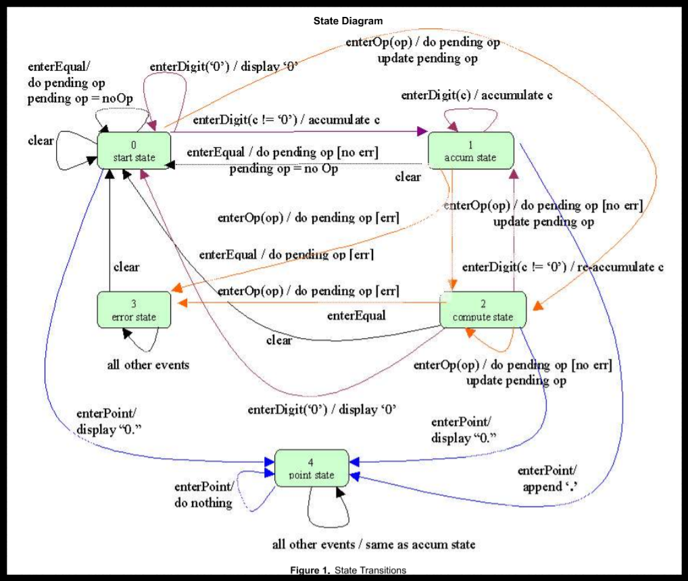

目前正在進行中的普通計算機程式設計, 採用 PyQt5 與 Python3 建立, 預計採用事件導向的方式完成.

<!-- PELICAN_END_SUMMARY -->

計算機視窗介面
---

PyQt5 普通計算機視窗介面:

  *  10 個數字鍵, 分別為 0, 1, 2, 3, 4, 5, 6, 7, 8, 9, 使用者按下個數字鍵, 將會在顯示幕中顯示該數字值
  *  小數點按鍵 ., 按下後顯示小數點
  *  加號按鍵 +, 按下後進行兩數相加
  *  減號按鍵 -, 按下後進行兩數相減
  *  乘號按鍵 *, 按下後進行兩數相乘
  *  除號按鍵 /, 按下後進行兩數相除
  *  等於按鍵 =, 將運算結果列在顯示幕
  *  清除顯示幕按鍵 C, 清除顯示幕內容並重置暫存資料

首先, 重複按數字鍵, 數字會進位, 例如: 按下兩次 1, 表示輸入 11
但是, 若目前顯示幕為 0, 則再按 0 並不會進位成為 00, 而仍然顯示 0, 而且若初始顯示幕為 0, 使用者按下運算數時, 顯示幕應該會清除, 然後配合使用者輸入的數字顯示.

因此按數字鍵的處理方法, 必須判斷:

  *  是否在等待輸入運算數階段, 若是則必須刷新顯示幕, 而且改變判斷狀態, 因為在初始時, 等待輸入運算數判斷變數為真,  一旦已經輸入數值, 則該變數必須重置
  *  顯示幕是否為 0 或 0.0, 這時若再輸入 0 則數值並不會累計, 而是維持原先顯示的 0 狀態

表示計算機經歷狀態改變, 而且在不同狀態下會有不同表現.

按下 C 清除螢幕, 重置各暫存值, 這時顯示幕為 0, 按一下 5, 則顯示幕中的 0 由 5 取代, 若再按一個 5, 則應該顯示 55, 表示可以字串堆疊的方式, 將原先顯示幕中的 5 字串, 再附加字串 5, 即可成為 55.

接著若按下 +, 則顯示幕上仍顯示 55, 若在 + 號之後, 再按下 3, 則顯示幕已經不能再以附加字串的方式處理, 變成 553, 而應該只顯示 3, 而且若接下來按下 =, 之前的 55 應該要在顯示 3 之前暫存, 以便能夠在按下 = 時, 完成 55 + 3 的運算, 並且將答案 58 列在顯示幕上.

因此, 若單純的兩數相加, 狀態分為"等待輸入運算", "運算子", 顯示幕中的數值以及目前的暫存值, 以 55 + 3 = 58, 總共經歷:

  *  一開始顯示幕為 0, "等待輸入運算數" 變數為 True, 累加暫存變數值為 0.
  *  使用者輸入第一個 5, 進入數字按鍵處理方法, 因"等待輸入運算數"為真, 因此刷新顯示幕, 重置"等待輸入運算數", 在顯示幕中列出 5.
  *  使用者輸入第二個 5, 再次進入數字按鍵處理方法, 因"等待輸入運算數"為假 (因為正處於運算數輸入階段), 因此不會刷新顯示幕, 而是將第二次輸入的 5 與顯示幕上的 5 堆疊, 顯示 55.
  *  使用者輸入 +, 這時顯示幕畫面仍顯示 55, 但是"運算子"變數存入 "+" 字串, 顯示幕中的 55 數值暫時放入累加變數, 成為左運算數, 運算子為  +, 離開之前, 將"等待輸入運算數"設為真.
  * 使用者再輸入數字 3, 進入數字按鍵處理方法, 因"等待輸入運算數"為真, 因此刷新顯示幕, 重置"等待輸入運算數", 在顯示幕中列出 3.
  * 使用者此時輸入 =, 左運算數即為暫存累加變數, 為 55, 運算子為  +, 顯示幕上的 3 則為目前的右運算數, = 按鍵處理方法, 進入暫存累加變數 55 再加上運算數 3 的運算, 得到 58, 將數值列在顯示幕, 所有變數重置恢復原始值, 即"等待輸入運算數"為真, 暫存變數歸零.

上述計算機的行為, 可以利用有限狀態機器的方式進行模擬, 普通計算機有多少狀態? 當計算機從某一狀態轉進另一狀態時, 應該如何表示出計算機該有的行為?

Github 協同展示倉儲: <https://github.com/scrum-1/scrum_pyqt5_calculator>

參考資料
---

[Calculator Walkthrough: Part 4](https://fsharpforfunandprofit.com/posts/calculator-complete-v2/)

[Finite State Machines and the State Design Pattern](https://cnx.org/contents/m6wVXVCe@2/Finite-State-Machines-and-the-)

電腦輔助設計實習監控程式
---

延續計算機程式課程所使用的 Python3 加上 PyQt5 語法, 可以開發用於監控虛擬或實體系統的視窗程式. 以下則為目前用於控制 V-rep 機電系統模擬的程式:

run.py 的程式碼主要導入位於 ui 目錄下的 Dialog.py 程式模組, 並且利用其中的 Dialog 類別建立案例, 產生 win 物件, 然後再以 show() 方法展示對話框.

<pre class="brush: python">
import sys
from PyQt5 import QtWidgets

from ui import Dialog

app = QtWidgets.QApplication(sys.argv)
win = Dialog.Dialog()
win.show()
sys.exit(app.exec())
</pre>

PyQt5 控制程式
---

此外, 對話框中有三個 press button 按鈕, 以及一個 line edit 用來顯示完成軌道運行的鋼球個數. 與 Dialog.ui 對應的對話框邏輯程式名稱定為 Dialog.py, 內容如下:

<pre class="brush: python">
# -*- coding: utf-8 -*-

"""
Module implementing Dialog.
"""
# 從 PyQt5.QtWidgets 模組中導入 QDialog 類別
from PyQt5.QtWidgets import QDialog
# 從同目錄中的 Ui_Dialog.py 模組導入 Ui_Dialog 類別
from .Ui_Dialog import Ui_Dialog

# for V-rep
# 從 remoteapi 目錄中導入 vrep.py 模組
from remoteapi import vrep
import sys
# 導入 threading, 用於建立執行緒
import threading
import time

class Dialog(QDialog, Ui_Dialog):
    """
    Class documentation goes here.
    """
    def __init__(self, parent=None):
        """
        Constructor
        
        @param parent reference to the parent widget
        @type QWidget
        """
        super(Dialog, self).__init__(parent)
        self.setupUi(self)
        # count, clientID, very_beginning, make 與 pill2kill 都是類別的成員屬性
        self.count = 0
        self.clientID = 0
        self.very_beginning = True
        # 以 self.start_thread 為標的, 建立執行緒
        self.make = threading.Thread(target=self.start_thread)
        self.pill2kill = threading.Event()
        # 從 Ui_Dialog 繼承而來的成員物件
        self.display.setText(str(self.count))
        # 為三個 press button 建立 signals 與 slots 對應
        self.start.clicked.connect(self.start_motor)
        self.stop.clicked.connect(self.stop_motor)
        self.pause.clicked.connect(self.pause_motor)
        
    # 啟動轉動馬達的 slot, 也就是按下 self.start 按鈕後將執行的對應方法
    def start_motor(self):
        # 利用執行緒執行 start, 執行緒只能啟動一次的判斷成員變數 self.very_beginning
        if self.very_beginning:
            # 啟動執行緒
            self.make.start()
            self.very_beginning = False
        else:
            # 暫停後, 重啟執行緒
            self.pill2kill.set
            #啟動模擬
            vrep.simxStartSimulation(self.clientID, vrep.simx_opmode_oneshot)
     
     # 停止馬達執行方法
    def stop_motor(self):
        # 按下停止鍵, 將會停止模擬, 重新回到原始設定畫面
        vrep.simxStopSimulation(self.clientID, vrep.simx_opmode_oneshot_wait)
    
    # 暫停執行處理方法
    def pause_motor(self):
        # 暫停執行緒, 暫停模擬
        #time.sleep(2)
        # 暫停執行緒
        self.pill2kill.clear()
        # 暫停模擬
        vrep.simxPauseSimulation(self.clientID, vrep.simx_opmode_oneshot_wait)
    
    # 啟動執行緒的對應方法
    def start_thread(self):
        # child threaded script: 
        # 內建使用 port 19997 若要加入其他 port, 在  serve 端程式納入
        #simExtRemoteApiStart(19999)
         
        vrep.simxFinish(-1)
         
        self.clientID = vrep.simxStart('127.0.0.1', 19997, True, True, 5000, 5)
        
        #啟動模擬
        vrep.simxStartSimulation(self.clientID, vrep.simx_opmode_oneshot)
        
        if self.clientID!= -1:
            print("Connected to remote server")
        else:
            print('Connection not successful')
            sys.exit('Could not connect')
         
        errorCode1, Revolute_joint_handle = vrep.simxGetObjectHandle(self.clientID,'Revolute_joint',vrep.simx_opmode_oneshot_wait)
        errorCode2, sensorHandle = vrep.simxGetObjectHandle(self.clientID,'Finish',vrep.simx_opmode_oneshot_wait)
        
        if errorCode1 == -1:
            print('Can not find left or right motor')
            sys.exit()
            
        while vrep.simxGetConnectionId(self.clientID) != -1:
            (errorCode3, detectionState1, detectedPoint1, detectedObjectHandle1, detectedSurfaceNormalVector1) = vrep.simxReadProximitySensor(self.clientID, sensorHandle, vrep.simx_opmode_streaming)
            if errorCode3 == vrep.simx_return_ok:
                if detectionState1:
                    self.count += 1
                    print("通過球總數:", self.count)

            # 將 self.count 顯示在 display
            self.display.setText(str(self.count))
            # 設定馬達的轉速
            vrep.simxSetJointTargetVelocity(self.clientID, Revolute_joint_handle, 0.5, vrep.simx_opmode_oneshot_wait)
    
        #終止模擬
        vrep.simxStopSimulation(self.clientID, vrep.simx_opmode_oneshot_wait)
</pre>

根據上述程式碼所完成的測試影片:

<iframe src="https://player.vimeo.com/video/244294061" width="640" height="360" frameborder="0" webkitallowfullscreen mozallowfullscreen allowfullscreen></iframe>

<a href="https://vimeo.com/244294061">國立虎尾科技大學機械設計工程系電腦輔助設計實習 - 二甲第十一週第二部分, 在期末機電資協同專案範例中, 加入感測器與控制用視窗程式示範</a> from <a href="https://vimeo.com/user24079973">國立虎尾科技大學機械設計工程系</a> on <a href="https://vimeo.com">Vimeo</a>.
