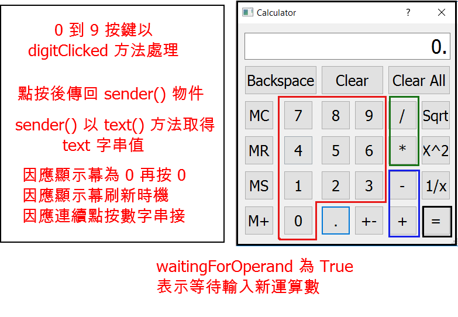

Python3 + PyQt5 計算機程式開發

<!-- PELICAN_END_SUMMARY -->

PyQt5 計算機程式說明
---

按鍵分類

  *  0 ~9 數字按建, 點按後由 digitClicked() 方法槽承接處理
  *  直接運算元, 包括 Sqrt, x^2 與 1/x, 點按後由 unaryOperatorClicked() 方法槽承接處理
  *  加或減運算元, 包括 + 與 - 運算, 點按後由 additiveOperatorClicked() 方法槽承接處理
  *  乘或除運算元, 包括 * 與 / 運算, 點按後由 multiplicativeOperatorClicked() 方法槽承接處理
  * 其餘按鍵則各自以特定的方法槽承接處理

變數與運算流程考量
 
  *  數字按鍵以 zero, one, two, three, four, five, six, seven, eight, nine 命名
  *  顯示幕以 display 命名
  *  等號以 equalButton 命名
  *  與 MS, M+, 或 MC 按鍵相關的計算機記憶體數值, 存入 sumInMemory 變數對應的記憶空間 
  *  以 sumSoFar 儲存累計數值, 使用者按下等號後, sumSoFar 重新計算結果, 並顯示在 display 幕, Clear All 按鍵則重置 sumSoFar 為 0
  *  以 factorSoFar 儲存乘或除運算子運算過程所得的暫存數值
  *  以 pendingAdditiveOperator 儲存使用者最後點按的加或減運算子字串
  *  以 pendingMultiplicativeOperator 儲存使用者最後點按的乘或除運算子字串
  *  以 waitingForOperand 界定使用者是否處理運算數輸入階段, 若 waitingForOperand 為 True, 表示計算機正在等待使用者"開始"輸入運算數
  *  waitingForOperand 起始值為 True, 只有重新進入 digitClicked 方法, display 才會 clear(), 否則在顯示幕非為 0 的情況下, 將堆疊數字字串
  *  因為考量先乘除後加減運算順序, 將加減與乘除處理方法分開, 若使用者輸入加減運算子後, 緊接乘除運算子, 計算機會先乘除運算後再加減
  *  直接運算元可以在使用者按下按鍵後, 直接對 display 中的數值進行處理, 無需其他暫存需求
  *  pendingAdditiveOperator, pendingMultiplicativeOperator, sumSoFar, factorSoFar 與 waitingForOperand, 在 Dialog 類別建構子中設定起始值
  
數字按鍵點按處理

  *  使用者點按數字按鍵, 將會送出該按鍵的 clicked() 訊號
  *  按鍵的 clicked() 訊號將會根據設定, 觸發 digitClicked() 方法槽
  *  由於 PyQt5 的 Push Button 以 Qt5 中的 QObject::sender() 送出訊號, 此函式會傳回 sender 作為 QObject 的指標
  *  因為此一與 Push Button 配合的 sender 為 Button 物件, 因此可以在 digitClicked() 函式中, 利用 sender().text() 取得按鍵的 text 字串
  *  假如使用者點按 0, display 顯示字串 0, 但是若一開始輸入兩個以上的 0, digitClicked() 應該仍只顯示 0 字串
  *  但是若計算機處於等待新運算數輸入時 (以 waitingForOperand 判定), 新數字在顯示前, display 應該要清除先前所顯示的數字
  *  最後, 除了在顯示幕為 0 之後的 0 按鍵輸入, digitClicked() 方法槽不會繼續判定是否清除顯示幕或堆疊數字字串外, 所按的數字將會堆疊顯示

直接運算按鍵處理

  *  Sqrt, x^2 與 1/x 等按鍵的處理方法為 unaryOperatorClicked(), 與數字按鍵的點按回應相同, 透過 sender().text() 取得按鍵上的 text 字串
  *  unaryOperatorClicked() 方法隨後根據 text 判定運算子後, 利用 display 上的運算數進行運算後, 再將結果顯示在 display 顯示幕
  *  若進行運算 Sqrt 求數值的平方根時, 顯示幕中為負值, 或 1/x 運算時, x 為 0, 都視為無法處理的情況, 以呼叫 abortOperation() 處理
  *  abortOperation() 方法則重置所有起始變數, 並在 display 中顯示 "####"
  *  直接運算子處理結束前, 運算結果會顯示在 display 中, 而且運算至此告一段落, 計算機狀態應該要回復到等待新運算數的階段, 因此 waitingForOperand 要重置為 True

加或減按鍵處理

  *  使用者按下加或減運算子按鍵時, 程式設定以 additiveOperatorClicked() 處理
  *  進入 additiveOperatorClicked() 後, 必須先查是否有尚未運算的乘或除運算子, 因為必須先乘除後才能加減
  *  先處理乘與除運算後, 再處理加或減運算後, 將 sumSoFar 顯示在 display 後, 必須重置 sumSoFar 為 0, 表示運算告一段落
  
乘或除按鍵處理

  *  使用者按下乘或除運算子按鍵時, 程式設定以 multiplicativeOperatorClicked() 處理
  *  進入 multiplicativeOperatorClicked() 後, 無需檢查是否有尚未運算的加或減運算子, 因為乘除運算有優先權
  *  先處理乘與除運算後, 再處理加或減運算, 將 sumSoFar 顯示在 display 後, 必須重置 sumSoFar 為 0, 表示運算告一段落

小數點按鍵處理

  * 使用者按下小數點按鍵後, 以 pointClicked() 方法處理, 直接在 display 字串中加上 "." 字串
  
數值變號按鍵處理

  *  使用者按下變號按鍵後, 由 changeSignClicked() 處理, 若顯示幕上為正值, 則在 display 字串最前面, 疊上 "-" 字串
  *  假如顯示幕上為負值, 則設法移除 display 上字串最前方的 "-" 字元

退格按鍵處理

  *  使用者按下退格按鍵後, 由 backspaceClicked() 處理, 這時可以利用 Python 字串數列中的 [:-1], 保留除了最後一個字元的字串
  *  離開 backspaceClicked() 前 ,將顯示幕中原有字串的 [:-1] 字串, 顯示在 display 上
  *  若退格後 display 上為空字串, 則顯示 0, 並且將 waitingForOperand 起始設為 True, 表示等待新運算數中

清除按鍵處理

  *  使用者按下 Clear 按鍵後, 以 clear() 方法處理, 進入函式後, 將現有的運算數重置為 0
  *  離開 clear() 前, 將 waitingForOperand 起始設為 True, 表示等待新運算數中
  *  ClearAll 按鍵, 則將所有變數全部重置為起始狀態

記憶體按鍵處理

  *  clearMemory() 方法與 "MC" 按鍵對應, 清除記憶體中所存 sumInMemory 設為 0
  *  readMemory() 方法與 "MR" 按鍵對應, 功能為讀取記憶體中的數值, 因此將 sumInMemory 顯示在 display, 作為運算數
  *  setMemory() 方法則與 "MS" 按鍵對應, 功能為設定記憶體中的數值，因此取 display 中的數字, 存入 sumInMemory
  *  addToMemory() 方法與 "M+" 按鍵對應, 功能為加上記憶體中的數值, 因此將 sumInMemory 加上 display 中的數值
  *  因為 setMemory() 與 addToMemory() 方法, 都需要取用 display 上的數值, 因此必須先呼叫 equalClicked(), 以更新 sumSoFar 與 display 上的數值

calculate() 方法

  *  calculate() 方法中的運算, 以 rightOperand 為右運算數
  *  當執行加或減運算時, 左運算數為 sumSoFar
  *  當執行乘或除運算時, 左運算數為 factorSoFar
  *  若運算過程出現除與 0 時, 將會回傳 False

PyQt5 參考資料
---

</img>

Qt5 - [sender()]

sip - [sip: sender()]

[sender()]: http://doc.qt.io/qt-5/qobject.html#sender
[sip: sender()]: https://github.com/kmolab/web_repository/blob/master/PyQt5_gpl-5.9.2/sip/QtCore/qobject.sip

PyQt5 計算機程式原始碼
---

<pre class="brush:python">
# Dialog 類別同時繼承 QDialog 與 Ui_Dialog 類別
class Dialog(QDialog, Ui_Dialog):
    """
    Class documentation goes here. (若有類別相關說明文件內容, 放在此處)
    """
    def __init__(self, parent=None):
        """
        Constructor (類別建構子)
        
        @param parent reference to the parent widget
        @type QWidget
        """
        # 利用 super 類別調用 parent 類別中的建構子
        super(Dialog, self).__init__(parent)
        # 上一行在 Python3 可以寫為 super().__init__()
        # 利用 Ui_Dialog 類別中的 setupUi 方法, 以 self 視窗部件建立使用者介面
        self.setupUi(self)
        # 以上程式碼由 Eric6 表單頁面中的滑鼠右鍵, Generate Dialog Code 指令產生
        # 當多個 signal 同時指向同一個 slot 處理時, 採用 for loop
        num_button = [self.one,  self.two,  \
        self.three,  self.four,  self.five,  self.six,  self.seven,  self.eight,  self.nine,  self.zero]
        # 用於產生加號與減號 signals 與 slots 用的數列
        plus_minus = [self.plusButton,  self.minusButton]
        # 用於產生乘號與除號 signals 與 slots 用的數列
        multiply_divide = [self.timesButton,  self.divisionButton]
        #self.one.clicked.connect(self.number)
        # 數字按鍵的 signals 與 slots 設定
        for i in num_button:
            i.clicked.connect(self.digitClicked)
        
        # 加減鍵的 signals 與 slogts 設定
        for i in plus_minus:
            i.clicked.connect(self.additiveOperatorClicked)
        
        # 等於按鍵的 signal 與 slot 設定
        self.equalButton.clicked.connect(self.equalClicked)
        # 清除
        self.clearButton.clicked.connect(self.clear)
        # 全部清除
        self.clearAllButton.clicked.connect(self.clearAll)
        # 清除記憶
        self.clearMemoryButton.clicked.connect(self.clearMemory)
        # 讀取記憶
        self.readMemoryButton.clicked.connect(self.readMemory)
        # 設定記憶
        self.setMemoryButton.clicked.connect(self.setMemory)
        # 按下小數點
        self.pointButton.clicked.connect(self.pointClicked)
        # 按下變號
        self.changeSignButton.clicked.connect(self.changeSignClicked)
        # 按下上一步
        self.backspaceButton.clicked.connect(self.backspaceClicked)
        # 加入記憶體
        self.addToMemoryButton.clicked.connect(self.addToMemory)
        # 單一運算子
        unaryOperator = [self.squareRootButton, self.powerButton,  self.reciprocalButton ]
        for i in unaryOperator:
            i.clicked.connect(self.unaryOperatorClicked)
        
        # 乘與除按建的 signals 與 slots 設定
        for i in multiply_divide:
            i.clicked.connect(self.multiplicativeOperatorClicked)
        
        # 等待運算的加或減
        self.pendingAdditiveOperator = ''
        
        # sumSoFar 儲存運算流程中所累計的數值
        # 當使用者按下 = 後, sumSoFar 重新計算並將數字顯示在 display 區
        # 當使用者按下 Clear All, sumSoFar 將重置回 0
        self.sumSoFar = 0.0
        # 起始時, 等待使用者輸入運算數值變數為真
        self.waitingForOperand = True
        
        # sumInMemory 儲存計算機記憶體中的值, 配合 MS, M+, 或 MC 按鈕使用
        self.sumInMemory = 0.0
        # factorSoFar 暫存按下乘或除運算時的數值
        self.factorSoFar = 0.0
        # 等待運算的乘或除
        self.pendingMultiplicativeOperator = ''

    def digitClicked(self):
        # sender() 為使用者點擊按鈕時送出的按鈕指標類別, 在此利用此按鍵類別建立案例
        # 所建立的 clickedButton 即為當下使用者所按下的按鈕物件
        clickedButton = self.sender()
        # text() 為利用按鈕物件的 text 方法取得該按鈕上所顯示的 text 字串
        digitValue = int(clickedButton.text())
        # when user clicks 0.0
        if self.display.text() == '0' and digitValue == 0.0:
            return
        
        # if under digit input process, clear display for the very first beginning
        # waitingForOperand 為 True 已經點按運算數值按鈕
        if self.waitingForOperand:
            # 清除 display 
            self.display.clear()
            # 將判斷是否已經點按運算數值按鈕的判斷變數重新設為  False
            self.waitingForOperand = False
        # 利用 setText() 設定 LineEdit 元件顯示字串, 利用 text() 取出目前所顯示的字串, 同時也可利用 text() 擷取按鈕物件上顯示的字串
        #self.display.setText(self.display.text() + self.sender().text())
        self.display.setText(self.display.text() + str(digitValue))
        
    def additiveOperatorClicked(self):
        # 確定按下加或減
        clickedButton = self.sender()
        # 確定運算子, 為加或減
        clickedOperator = clickedButton.text()
        # 點按運算子之前在 display 上的數字, 為運算數
        operand = float(self.display.text())
        
        # 納入乘與除之後的先乘除後加減運算邏輯, 且納入連續按下乘或除可累計運算
        if self.pendingMultiplicativeOperator:
            if not self.calculate(operand, self.pendingMultiplicativeOperator):
                self.abortOperation()
                return

            self.display.setText(str(self.factorSoFar))
            operand = self.factorSoFar
            self.factorSoFar = 0.0
            self.pendingMultiplicativeOperator = ''
            
            
        # 假如有等待運算的加或減, 進入執行運算
        # 且納入連續按下加或減時, 可以目前的運算數及運算子累計運算
        if self.pendingAdditiveOperator:
            if not self.calculate(operand, self.pendingAdditiveOperator):
                self.abortOperation()
                return
            # 顯示目前的運算結果
            self.display.setText(str(self.sumSoFar))
        else:
            # 假如 self.pendingAdditiveOperator 為 False, 則將運算數與 self.fumSoFar 對應
            self.sumSoFar = operand
            
        # 能夠重複按下加或減, 以目前的運算數值執行重複運算
        self.pendingAdditiveOperator = clickedOperator
        # 進入等待另外一個運算數值的階段, 設為 True 才會清空 LineEdit
        self.waitingForOperand = True

    # 處理使用者按下乘或除按鍵時的 slot 方法
    def multiplicativeOperatorClicked(self):
        clickedButton = self.sender()
        clickedOperator = clickedButton.text()
        # 將按鈕顯示的 text 轉為浮點數
        operand = float(self.display.text())

        # 若連續按下乘或除, 則以目前的運算數與運算子執行運算
        if self.pendingMultiplicativeOperator:
            if not self.calculate(operand, self.pendingMultiplicativeOperator):
                self.abortOperation()
                return

            # 將目前乘或除的累計運算數顯示在 display 上
            self.display.setText(str(self.factorSoFar))
        else:
            self.factorSoFar = operand

        # 能夠重複按下乘或除, 以目前的運算數值執行重複運算
        self.pendingMultiplicativeOperator = clickedOperator
        self.waitingForOperand = True

    def unaryOperatorClicked(self):
        clickedButton = self.sender()
        clickedOperator = clickedButton.text()
        operand = float(self.display.text())

        if clickedOperator == "Sqrt":
            if operand < 0.0:
                self.abortOperation()
                return

            result = math.sqrt(operand)
        elif clickedOperator == "X^2":
            result = math.pow(operand, 2.0)
        elif clickedOperator == "1/x":
            if operand == 0.0:
                self.abortOperation()
                return

            result = 1.0 / operand

        self.display.setText(str(result))
        self.waitingForOperand = True
        
    def equalClicked(self):
        # 從 display 取的運算數值
        operand = float(self.display.text())
        
        # 先乘除的運算處理
        if self.pendingMultiplicativeOperator:
            if not self.calculate(operand, self.pendingMultiplicativeOperator):
                self.abortOperation()
                return
            # factorSoFar 為乘或除運算所得之暫存數值
            operand = self.factorSoFar
            self.factorSoFar = 0.0
            self.pendingMultiplicativeOperator = ''
        
        # 若有等待加或減的運算子, 執行運算
        if self.pendingAdditiveOperator:
            if not self.calculate(operand, self.pendingAdditiveOperator):
                self.abortOperation()
                return

            self.pendingAdditiveOperator = ''
        else:
            self.sumSoFar = operand

        self.display.setText(str(self.sumSoFar))
        self.sumSoFar = 0.0
        self.waitingForOperand = True

    # 右運算數與等待運算子當作輸入
    def calculate(self, rightOperand, pendingOperator):
        # 進入計算流程時, 用目前輸入的運算數值與 self.sumSoFar 執行計算
        if pendingOperator == "+":
            self.sumSoFar += rightOperand
            
        elif pendingOperator == "-":
            self.sumSoFar -= rightOperand

        elif pendingOperator == "*":
            self.factorSoFar *= rightOperand
            
        elif pendingOperator == "/":
            if rightOperand == 0.0:
                return False

            self.factorSoFar /= rightOperand

        return True

    def pointClicked(self):
        if self.waitingForOperand:
            self.display.setText('0')

        if "." not in self.display.text():
            self.display.setText(self.display.text() + ".")

        self.waitingForOperand = False

    def changeSignClicked(self):
        text = self.display.text()
        value = float(text)

        if value > 0.0:
            text = "-" + text
        elif value < 0.0:
            text = text[1:]

        self.display.setText(text)

    def backspaceClicked(self):
        if self.waitingForOperand:
            return

        text = self.display.text()[:-1]
        if not text:
            text = '0'
            self.waitingForOperand = True

        self.display.setText(text)

    # clearButton 按鍵的處理方法
    def clear(self):
        # 在等待運算數階段, 直接跳出 slot, 不會清除顯示幕
        if self.waitingForOperand:
            return

        self.display.setText('0')
        # 清除顯示幕後, 重置等待運算數狀態變數
        self.waitingForOperand = True

    # clearAllButton 按鍵處理方法
    def clearAll(self):
        self.sumSoFar = 0.0
        self.factorSoFar = 0.0
        self.pendingAdditiveOperator = ''
        self.pendingMultiplicativeOperator = ''
        self.display.setText('0')
        self.waitingForOperand = True

    def clearMemory(self):
        self.sumInMemory = 0.0

    def readMemory(self):
        self.display.setText(str(self.sumInMemory))
        self.waitingForOperand = True

    def setMemory(self):
        self.equalClicked()
        self.sumInMemory = float(self.display.text())

    def addToMemory(self):
        self.equalClicked()
        self.sumInMemory += float(self.display.text())

    def abortOperation(self):
        self.clearAll()
        self.display.setText("####")
</pre>